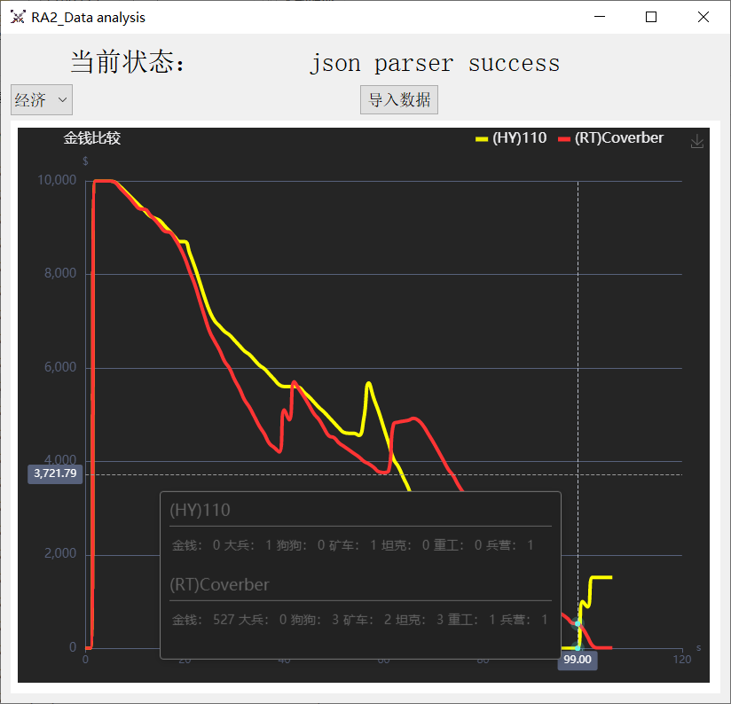
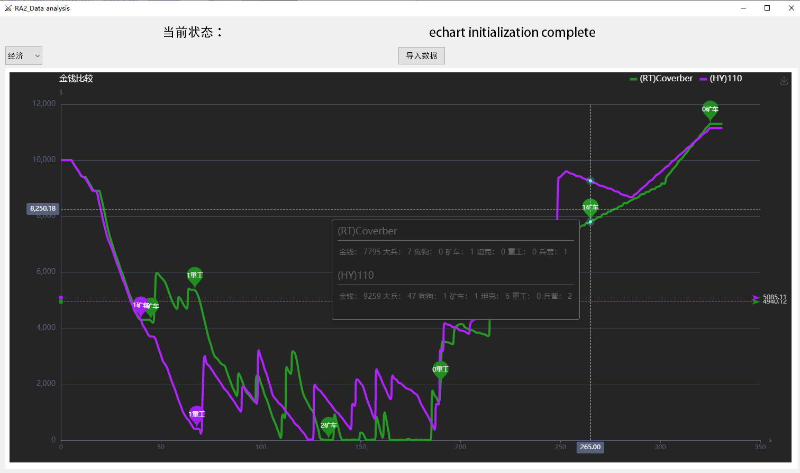
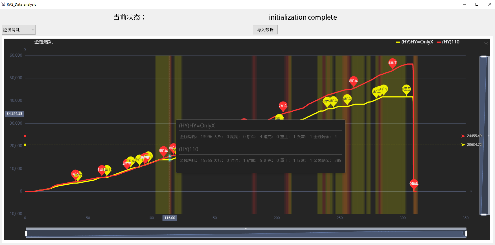

# RA2_grabdata
主要用于对局后数据的显示  
目前只做了一个页面
## 界面展示
### 0.1版本

### 0.2版本
新增了坦克和矿车变换时的标注，以及平均经济的横线显示  

### 0.3版本
新增了卡钱状态的阴影的标注，优化数据采集流程，优化显示效果  

## 联系方式
QQ:826955320
## 项目计划
待完善的功能：  
- 新增坦克数量变化图表  
- 时间轴优化，抹去游戏启动读条经济为0部分的时间  
- 动态调整时间轴，监测到坦克数量变化时，定时器频率增加  
- 游戏时间归一化，优化游戏过程中的卡顿时间  
## 一些闲谈
写这个小软件是为了帮助大家能够根据对局的数据，科学客观的提升自己的对战技术水平。  
在很早之前，我曾经用一个月的时间写过一个用MFC抓数据去生成html的代码，这个软件在时代的进步和我知识水平的稍稍长进中，也变成了一两天就能写完的这份QT框架的代码。可以说我是在游戏中学到了不少的课外知识，非常感谢有这么一款经典游戏能伴随我走过大学的四年。  
如果你对红警的相关知识也很感兴趣，并且具备一定的编程基础，欢迎与我联系交流。如果你对这不感兴趣，并且对红警对战并不内行，希望你不要用代码中的部分数据挪为他用，破坏了这一份美好的和谐，谢谢。
